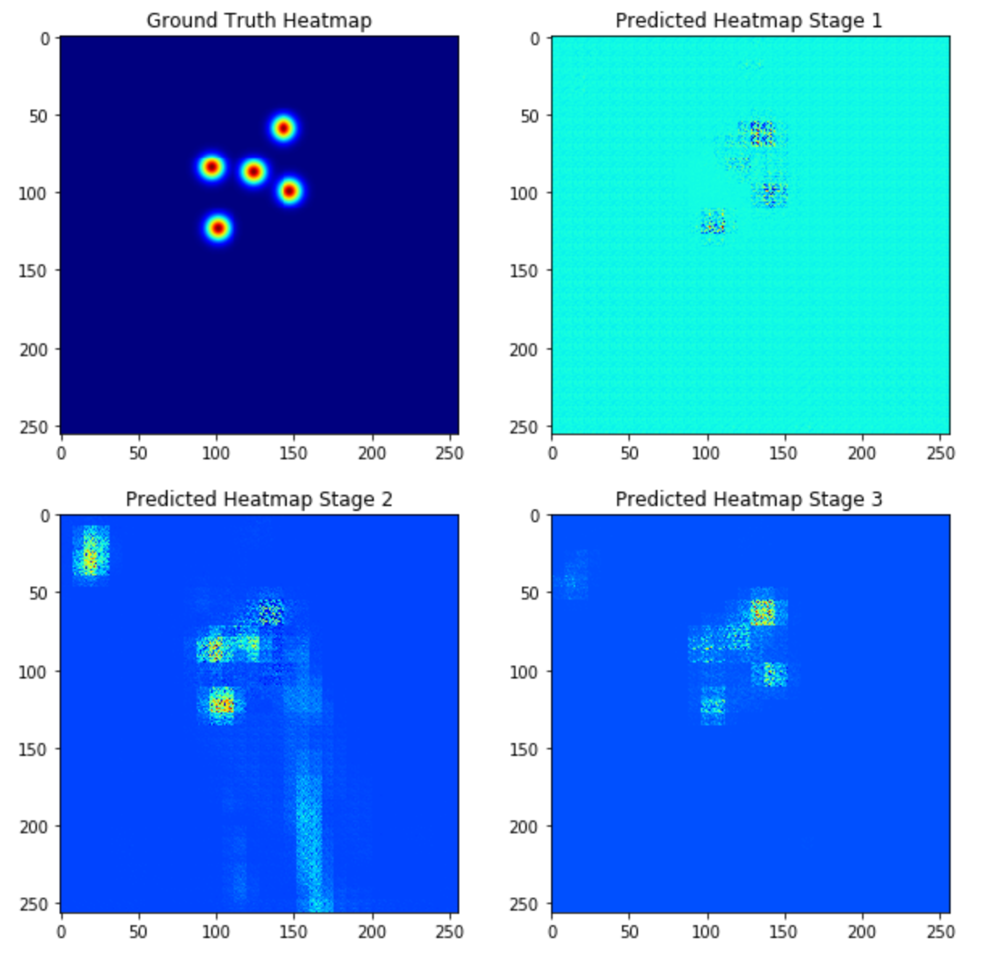

# Data-Science-Portfolio by Freeman Mak

This portfolio is a compilation of notebooks which I created for data analysis or for exploration of machine learning algorithms.

# Computer Vision
## Graduate Research - Capturing User Biometrics using Computer Vision and Deep Learning (Work in Progress...)

As part of my graduate research I am working on a new method of capturing touch biometrics of smartphone interactions using a computer vision approach. The idea is simple, given a recording of a user interacting with their phone, we can use computer vision and deep learning techniques to figure out what they are typing. We treat this as a heatmap regression problem, in which I implemented my own deep learning model that was inspired by "Convolutional Pose Machines" and "Fully Convolutional Networks". The picture above shows our results for the heatmap regressor at various different stages of our model.

# Natural Language Processing:
## Bag of Words Meets Bag of Popcorn
<a href="https://nbviewer.jupyter.org/github/Fmak95/Bag-of-words-meet-bag-of-popcorn/tree/master/Notebooks/">nbviewer</a> <a href="https://github.com/Fmak95/Bag-of-words-meet-bag-of-popcorn/tree/master/Notebooks">Github</a>

In this notebook I try to identify if a movie review is positive or negative. This notebook gave me lots of experience with word modelling (Bag of Words, Word Vectors, idf) as well as deep learning practice (RNNs and LSTMs).

## Data Science Job Market Analysis
<a href="https://nbviewer.jupyter.org/github/Fmak95/DataScience_JobMarket_Analysis/blob/master/notebooks/exploration.ipynb">nbviewer</a> <a href="https://github.com/Fmak95/DataScience_JobMarket_Analysis">Github</a>

For this project, I gathered job posting data online by creating a web scraper and then performed analysis to gain insights about what skills are most sought after.

# Data Exploration
## Two Sigma Connect: Rental Listing Inquiries
<a href="https://nbviewer.jupyter.org/github/Fmak95/RentalListingInquiries/blob/master/RentalListingInquiries.ipynb">nbviewer</a> <a href="https://github.com/Fmak95/RentalListingInquiries/blob/master/RentalListingInquiries.ipynb">Github</a>

This kaggle challenge was issued by Two Sigma in which the goal was to classify a rental listing into one of three interest levels: "low/medium/high". General description and data is available on <a href="https://www.kaggle.com/c/two-sigma-connect-rental-listing-inquiries">kaggle</a>. I perform an in-depth data exploration, visualize the data and search for insights. Findings are summarized in the notebook under the **Data Exploration Findings** section.

# Regression Problems
## Caterpillar Tube Pricing
<a href="https://nbviewer.jupyter.org/github/Fmak95/Caterpillar-Tube-Pricing/blob/master/Caterpillar_Tubes_Pricing.ipynb">nbviewer</a> <a href="https://github.com/Fmak95/Caterpillar-Tube-Pricing/blob/master/Caterpillar_Tubes_Pricing.ipynb">Github</a>

This challenge was issued by Caterpillar: given a dataset containing multiple CSV files that contained information pertaining tube assemblies, predict their price. General description and data are available on <a href="https://www.kaggle.com/c/caterpillar-tube-pricing">Kaggle</a>. Dataset consists of many files, so there is an additional challenge in combining the data and selecting the features.

## House Prices: Advanced Regression Techniques
<a href="https://nbviewer.jupyter.org/github/Fmak95/House-Prices-Advanced-Regression-Techniques/blob/master/House_Prices.ipynb">nbviewer</a> <a href="https://github.com/Fmak95/House-Prices-Advanced-Regression-Techniques/blob/master/House_Prices.ipynb">Github</a>

A classic machine learning problem: based on a variety of household features, predict the price of the house. General description and data are available on <a href="https://www.kaggle.com/c/house-prices-advanced-regression-techniques">Kaggle</a>. The dataset has a lot of features and many missing values. This gives interesting possibilities for feature transformation, data visualization, feature engineering and data imputation techniques.

# Classification Problems
## CareerCon 2019 - Help Navigate Robots
<a href="https://nbviewer.jupyter.org/github/Fmak95/CareerCon-2019/blob/master/CareerCon_2019.ipynb">nbviewer</a> <a href="https://github.com/Fmak95/CareerCon-2019/blob/master/CareerCon_2019.ipynb">Github</a>

This was a recruitment competition on <a href="https://www.kaggle.com/c/career-con-2019">Kaggle</a>. Unfortunately I entered this competition after the deadline, but I still completed the challenge for some extra practice! Given IMU sensor information on robots, we were asked to determine the surface in which the robot was traversing on (carpet, wood, concrete...). I played around with a deep learning approach, tackling the problem with a fully connected, multi layer neural network. I also used some model evaluation techniques: cross-validation, precision/recall scores.

## Titanic: Machine Learning from Disaster
<a href="https://nbviewer.jupyter.org/github/Fmak95/Titanic-Machine-Learning-From-Disaster/blob/master/Titanic.ipynb">nbviewer</a> <a href="https://github.com/Fmak95/Titanic-Machine-Learning-From-Disaster/blob/master/Titanic.ipynb">Github</a>

Titanic: Machine Learning from Disaster is a knowledge competition on Kaggle. Many people started practicing in machine learning with this competition, so did I. This is a binary classification problem: based on information about Titanic passengers we predict whether they survived or not. General description and data are available on <a href="https://www.kaggle.com/c/titanic/overview">Kaggle</a>. Titanic dataset provides interesting opportunities for feature engineering.

## Digit Recognizer
<a href="https://nbviewer.jupyter.org/github/Fmak95/DigitRecognizer/blob/master/DigitRecognizer.ipynb">nbviewer</a> <a href="https://github.com/Fmak95/DigitRecognizer/blob/master/DigitRecognizer.ipynb">Github</a>

This was a competition on <a href="https://www.kaggle.com/c/digit-recognizer">Kaggle</a> in which we tried to recognize handwritten digits. This competition provided experience with convolutional neural networks and classical computer vision techniques. 
